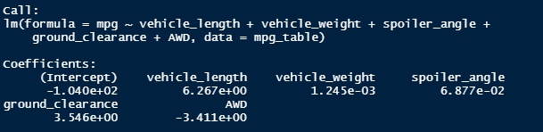
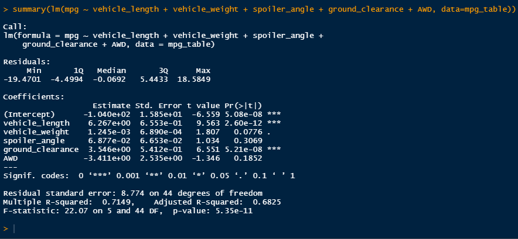
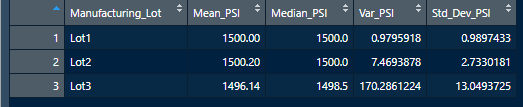
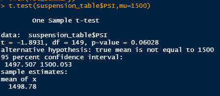
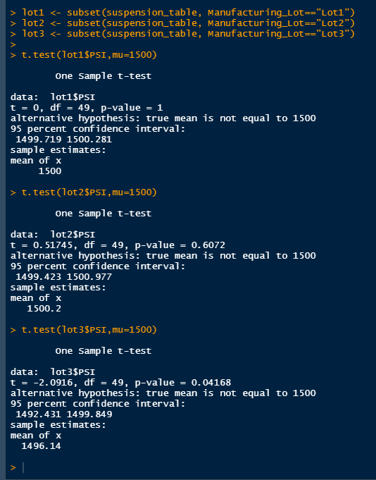

# MechaCar_Statistical_Analysis

## Linear Regression to Predict MPG

After running a linear regression model on the data, it appears that the variables/coefficents of the vehicle length and the vehicle ground clearance provided non-random amounts of variance to the mpg values in the dataset. That is to say, the vehicle length and vehicle ground clearance have a significant impact on miles per gallon on the MechaCar prototype. Conversely, the vehicle weight, spoiler angle, and All Wheel Drive (AWD) have p-Values that indicate a random amount of variance with the dataset.

The p-value is 5.35e-11 (0.0000000000535) which is less than the significant level of 0.05. Due to this, the slope is not equal to zero and there is sufficent statistical evidence to reject the null hypothesis.

The r-squared value of this model is 0.7149. This indicates that approximately 72% (if rounded) of all predictions of the mpg of MechaCar prototypes will be correct.

## Summary Statistics on Suspension Coils
The design specifications for the MechaCar suspension coils dictate that the variance of the suspension coils must not exceed 100 pounds per square inch (PSI). From the below image that examines all 3 lots, we can see that the suspension coils have a variance of 62.29356 PSI. This is within the requirement for the variance not exceeding 100 PSI.

When looking at each of the 3 lots individually however, we can see that Lot 3 shows a significantly higher variance than Lots 1 and 2. Lot 3's variance at 170.2861224 far exceeds the 100 PSI mandate. Meanwhile, the variance in Lots 1 and 2 are much closer in number and appear to be on the opposite side of the variance spectrum. Therefore, we can safely conclude that Lot 3 is disproportionally affecting the variance level when looking at the lot data together as a whole.

## T-Tests on Suspension Coils
briefly summarize your interpretation and findings for the t-test results.

## Study Design: MechaCar vs Competition
Write a short description of a statistical study that can quantify how the MechaCar performs against the competition. In your study design, think critically about what metrics would be of interest to a consumer: for a few examples, cost, city or highway fuel efficiency, horse power, maintenance cost, or safety rating.

In your description, address the following questions:
What metric or metrics are you going to test?
What is the null hypothesis or alternative hypothesis?
What statistical test would you use to test the hypothesis? And why?
What data is needed to run the statistical test?
